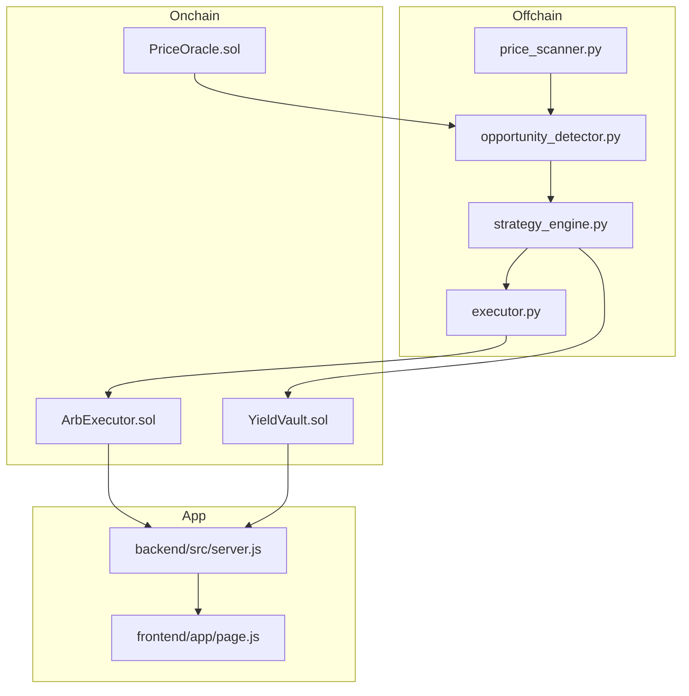

# PredictArb Technical Guide

## 1. Architecture

### 1.1 System overview

PredictArb runs as a hybrid system:

- Solidity contracts on BSC/opBNB for capital and execution.
- Python daemon for scanning, inference, and transaction dispatch.
- Node backend + WebSocket bridge for real-time monitoring.
- Next.js dashboard for visibility and demo UX.



### 1.2 Contract responsibilities

- `ArbExecutor.sol`
  - owner-only execution path
  - market allowlist
  - min-profit checks
  - pause/unpause controls
- `YieldVault.sol`
  - share accounting for deposits/withdrawals
  - APY source registry
  - rebalancing to best source
- `PriceOracle.sol`
  - trusted reporter model
  - freshness window checks
  - cross-platform gap computation

### 1.3 Agent responsibilities

- `price_scanner.py`: polls market sources (with offline mock fallback).
- `opportunity_detector.py`: scores gaps (model if available, otherwise heuristic).
- `strategy_engine.py`: optional OpenAI model to pick strategy.
- `executor.py`: builds/sends txs (or simulates when `DRY_RUN=true`).
- `main.py`: orchestrates scanner + trading loop.

## 2. Setup & Run (One-by-One)

### 2.1 Prerequisites

- Node.js 20+
- Python 3.11+
- Redis 7+

### 2.2 Install dependencies

```bash
cp .env.example .env
npm install
pip install -r requirements.txt
cd backend && npm install && cd ..
cd frontend && npm install && cd ..
```

### 2.3 Configure environment

Edit `.env`:

- `BSC_RPC`, `OPBNB_RPC`
- `AGENT_PRIVATE_KEY`
- `BSCSCAN_API_KEY`
- `OPENAI_API_KEY` (optional)
- contract addresses after deployment

### 2.4 Compile and test contracts

```bash
npm run compile
npm test
```

### 2.5 Deploy contracts

```bash
npm run deploy:bsc
# optional
npm run deploy:opbnb
```

Deployment artifact is written to `.deployments/<network>.json`.
Copy addresses into `bsc.address`.

### 2.6 Start runtime services

Terminal 1:
```bash
cd backend && npm run dev
```

Terminal 2:
```bash
cd frontend && npm run dev
```

Terminal 3:
```bash
python -m agent.main
```

### 2.7 Verify system health

- API health: `http://localhost:8080/api/health`
- UI: `http://localhost:3001` (or `http://localhost:$PORT` if overridden)
- Live stream: `ws://localhost:8080/live`

## 3. Demo Guide

1. Start Redis.
2. Start backend, frontend, and agent.
3. Open dashboard and watch opportunities stream in.
4. Observe status transitions (`scanning` -> `trading` / `yield`).
5. Review generated transactions in live log.

## 4. Security Notes

- Contracts include pause switches and owner-gated sensitive actions.
- Profit floor prevents low-quality executions.
- Agent is `DRY_RUN=true` by default for safer local testing.
- Production deployment should use HSM/KMS and multisig ownership.
